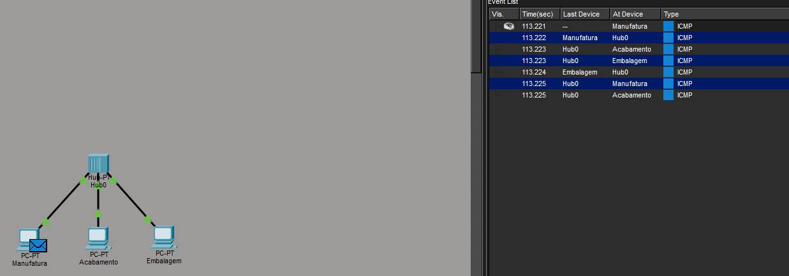
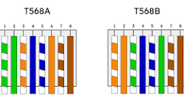

# Aula 01 - Redes

## Comandos de diagnóstico de rede

### `ping` - verificar a conexão

```cmd
ping [IP]
```

Retorna o IP de destino, os pacotes enviados/recebidos e o **TTL** (*Time To Live*), que indica quantos saltos (roteadores) o pacote ainda pode atravessar antes de ser descartado.

### `tracert` - verificar a rota

```cmd
tracert [IP]
```

Mostra todos os saltos (roteadores) percorridos pelo pacote até chegar ao destino.

## Broadcast em uma rede com Hub

O **Hub** é um dispositivo de rede que opera na camada física e **não é inteligente**: ele não sabe para qual computador uma mensagem deve ir. Por isso, sempre que um pacote chega em uma das suas portas, o Hub **repete esse pacote para todas as outras portas**, ou seja, para todos os outros computadores conectados a ele. Esse comportamento é chamado de **broadcast**.

Exemplo com 3 computadores conectados a um Hub (Manufatura, Acabamento e Embalagem):

1. O computador **Manufatura** envia um pacote **ICMP** (ping) destinado a outro computador específico.
2. O pacote chega ao **Hub0**.
3. O **Hub0**, por não conseguir filtrar o destino, envia (broadcast) uma cópia do pacote para **todas** as portas: tanto para o **Acabamento** quanto para o **Embalagem**, mesmo que a mensagem seja destinada a apenas um deles.
4. Cada computador recebe o pacote e verifica o endereço de destino: apenas o computador correto processa a mensagem, os demais descartam o pacote.

Isso mostra a principal desvantagem do Hub em relação a dispositivos mais modernos (como o **Switch**): o tráfego é desnecessariamente replicado para todas as portas, aumentando o consumo de banda e reduzindo a eficiência da rede, além de gerar colisões quando dois dispositivos tentam transmitir ao mesmo tempo.



## Protocolo DNS

O DNS (*Domain Name System*) funciona como uma espécie de lista telefônica, em que um "nome" (domínio) é armazenado no lugar de um endereço IP, facilitando a memorização.

Para fazer o mapeamento entre um endereço IP e um nome de domínio, utilize o seguinte comando:

```cmd
nslookup [DNS]
```

**Resposta não autoritativa**: indica que a máquina não precisou consultar diretamente o servidor responsável pelo domínio, pois já tinha o mapeamento IP-DNS em cache (obtido de outro servidor intermediário).

## Cabos de rede

### RJ45 - Padrão TIA/EIA T568A

Os canais 1 e 2 (verde) e 3 e 6 (laranja) são responsáveis pelo envio e pela recepção de dados. O conector se encaixa na parte de trás da placa de rede do computador e, internamente, a placa inverte os canais: os canais que enviam dados no cabo são os mesmos que recebem dados na placa de rede, e vice-versa.

No caso de uma conexão direta entre dois computadores (sem um Hub ou Switch no meio), o cabo de rede precisa ser diferente, pois ambas as placas de rede enviam e recebem nos mesmos canais, o que causaria **colisão de dados**. Por isso existe o cabo cruzado.

### Crossover - Padrão TIA/EIA T568B

Nesse padrão, os canais de recepção e envio são invertidos em relação ao cabo T568A, o que torna a conexão direta entre dois computadores possível, já que a colisão deixa de ocorrer.

Existe também uma correção feita via software chamada **Auto MDI/MDIX**, que detecta o tipo de cabo Ethernet conectado (direto ou cruzado) e ajusta automaticamente os pinos da porta, invertendo os canais conforme necessário. Isso elimina a necessidade de usar cabos específicos (cruzado, no caso de computador <-> computador) para conectar computadores ou switches.



> "Quando utilizamos um padrão diferente em cada ponta, o que estamos fazendo é ligar os pinos que transmitem dados em um dispositivo com os que recebem dados no outro. Dessa forma, evitamos colisões de dados." - 
[Entendendo cabos de rede](https://www.alura.com.br/artigos/entendendo-os-cabos-de-rede)